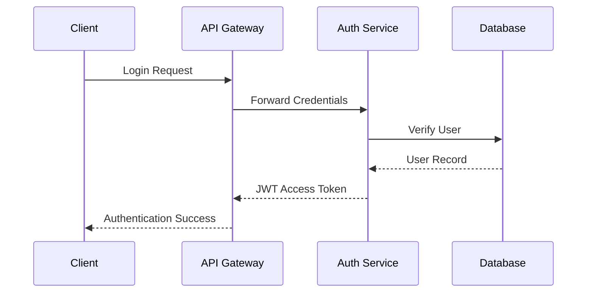
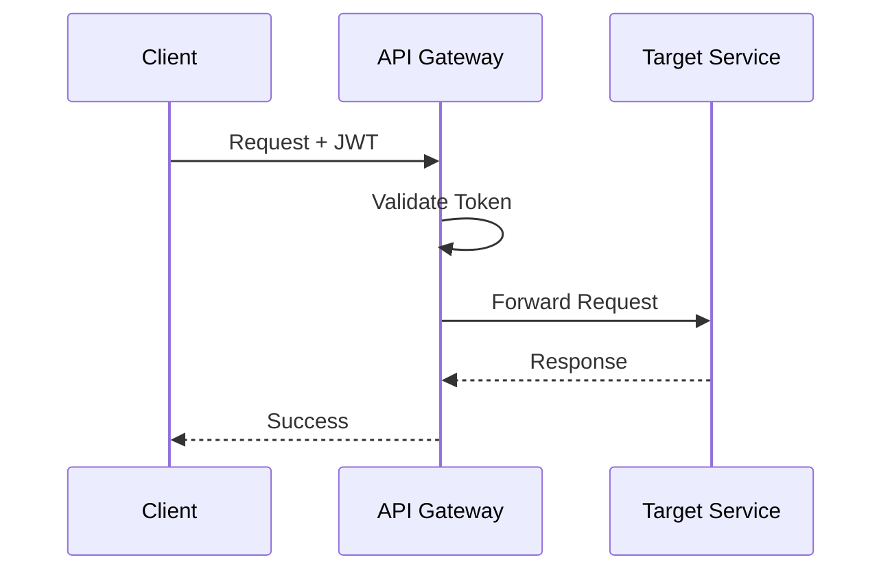
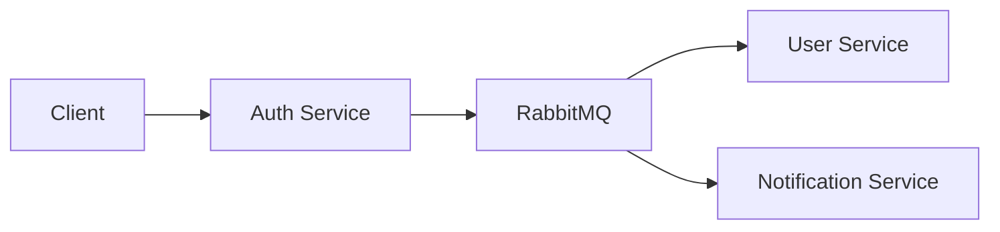

# BlipChat

> A scalable, event-driven microservices chat platform built with **Node.js**, **TypeScript**, **Express**, **RabbitMQ**, **Redis**, **MongoDB**, and **PostgreSQL**.

BlipChat is a production-oriented backend system that shows how modern messaging platforms can be built using independently deployable services, asynchronous messaging, a centralized API gateway, and shared internal libraries — the same patterns used by engineering teams at companies like Netflix, Uber, Spotify, and Meta.

Rather than a simple CRUD app, BlipChat is a hands-on exploration of:

- Distributed systems & microservices architecture
- Event-driven communication (RabbitMQ)
- JWT-based authentication & the API Gateway pattern
- Service-to-service communication with database-per-service isolation
- Redis caching, shared internal packages, and Docker-based deployment

---

## Table of Contents

1. [Key Features](#key-features)
2. [System Architecture](#system-architecture)
3. [Technology Stack](#technology-stack)
4. [Monorepo Structure](#monorepo-structure)
5. [Services & Packages](#services--packages)
6. [Authentication & Security](#authentication--security)
7. [Messaging Architecture (RabbitMQ)](#messaging-architecture-rabbitmq)
8. [Database Design](#database-design)
9. [Redis Architecture](#redis-architecture)
10. [API Documentation](#api-documentation)
11. [Getting Started](#getting-started)
12. [Environment Variables](#environment-variables)
13. [Scalability & Production Deployment](#scalability--production-deployment)
14. [Future Improvements](#future-improvements)
15. [Engineering Highlights](#engineering-highlights)
16. [License & Author](#license--author)

---

## Key Features

| Feature                           | Description                                                                                       |
| --------------------------------- | ------------------------------------------------------------------------------------------------- |
| 🚀 **Microservices Architecture** | Independently deployable services (Gateway, Auth, User, Chat), each owning its own logic and data |
| 🌐 **Centralized API Gateway**    | Single entry point handling auth, routing, validation, and logging                                |
| 📨 **Event-Driven Communication** | RabbitMQ decouples services for fault tolerance and background processing                         |
| 🔐 **JWT Authentication**         | Stateless auth with registration, login, and protected routes                                     |
| ⚡ **Redis Integration**          | In-memory store for sessions, presence, and cached data                                           |
| 📦 **Shared Internal Package**    | Common auth, validation, error handling, and event contracts across services                      |
| 🐳 **Dockerized Development**     | One-command startup for the full stack via Docker Compose                                         |
| 🛡️ **Type-Safe Development**      | End-to-end TypeScript for safer refactoring and better DX                                         |
| 📁 **pnpm Monorepo**              | Shared dependencies and centralized tooling across services                                       |

---

## System Architecture

Every client request enters through the API Gateway, which authenticates and routes it to the appropriate service. Services communicate synchronously over HTTP for immediate needs and asynchronously via RabbitMQ for events. Each service owns its own database.

```text
                    ┌───────────────────────────┐
                    │       Client Apps         │
                    │ Web • Mobile • Desktop    │
                    └─────────────┬─────────────┘
                                  │
                                  ▼
                    ┌───────────────────────────┐
                    │        API Gateway        │
                    │ Auth · Validation · Route │
                    └─────────────┬─────────────┘
                 ┌────────────────┼────────────────┐
                 ▼                ▼                ▼
        ┌──────────────┐ ┌──────────────┐ ┌──────────────┐
        │ Auth Service │ │ User Service │ │ Chat Service │
        └──────┬───────┘ └──────┬───────┘ └──────┬───────┘
               │                │                │
               └──────────┬─────┴─────┬──────────┘
                          ▼           ▼
                 ┌─────────────┐ ┌──────────────┐
                 │  RabbitMQ   │ │    Redis     │
                 └─────────────┘ └──────────────┘

        Each service owns and manages its own database.
```

### Architectural Principles

- **Domain isolation** — each service owns its business logic and persistence layer, minimizing coupling.
- **API Gateway pattern** — clients only ever talk to the gateway, never to services directly.
- **Event-driven design** — services publish domain events instead of relying solely on synchronous calls, so consumers can react independently.
- **Shared internal library** — cross-cutting concerns (auth middleware, event contracts, validation, logging) live in one package so every service follows the same standards.

---

## Technology Stack

| Category         | Technology                                  |
| ---------------- | ------------------------------------------- |
| Language         | TypeScript                                  |
| Runtime          | Node.js                                     |
| Framework        | Express.js                                  |
| Package Manager  | pnpm Workspaces                             |
| Authentication   | JWT                                         |
| Messaging        | RabbitMQ                                    |
| Cache            | Redis                                       |
| Databases        | PostgreSQL & MongoDB (polyglot persistence) |
| Containerization | Docker & Docker Compose                     |
| Tooling          | ESLint, shared TS config packages           |

**Why polyglot persistence?** Each service picks the database that fits its domain best — PostgreSQL for relational data (e.g. auth), MongoDB for flexible document storage (e.g. chat) — rather than forcing one engine on every workload.

---

## Monorepo Structure

BlipChat uses a **pnpm workspace monorepo**: one repository, independently deployable services, and shared tooling.

```
BlipChat/
│
├── apps/
│   ├── gateway-service/
│   ├── auth-service/
│   ├── user-service/
│   └── chat-service/
│
├── packages/
│   ├── common/
│   ├── typescript-config/
│   └── eslint-config/
│
├── docker-compose.yml
├── pnpm-workspace.yaml
├── package.json
└── README.md
```

**Why a monorepo?** Shared code without publishing packages, unified dependency management, consistent linting, atomic cross-service commits, and simplified local development — at the cost of a single repo to coordinate rather than many.

---

## Services & Packages

### API Gateway

The single public-facing entry point. Handles JWT authentication, authorization, request validation, rate limiting, logging, and proxying to downstream services.

| Endpoint prefix | Target Service         |
| --------------- | ---------------------- |
| `/api/auth/*`   | Authentication Service |
| `/api/users/*`  | User Service           |
| `/api/chat/*`   | Chat Service           |

### Authentication Service

System of record for identity: registration, login, password hashing, JWT issuance/validation, refresh tokens, and auth-related events.

### User Service

Owns profile data and user-facing business logic: profile updates, lookup, and search — deliberately independent from authentication.

### Chat Service

Owns conversations, messages, history, and read/delivery status. Designed to scale independently as messaging volume grows, and to extend cleanly into WebSocket/Socket.IO-based realtime messaging later.

### Shared Common Package

Auth middleware, error classes, event contracts, shared DTOs, logger, validators, and utilities — consumed by every service so behavior stays consistent across the platform.

---

## Authentication & Security

Authentication is centralized in the Auth Service; authorization is enforced at the API Gateway, which every request must pass through.



Once authenticated, every request carries a JWT that the gateway validates before forwarding it downstream:



**Why JWT?** Stateless verification means no server-side session store, which keeps horizontal scaling simple — any gateway instance can validate any request.

**Defense in depth:**

- Passwords are salted and hashed — never stored in plaintext.
- Requests are validated (required fields, types, payload shape) before reaching business logic.
- Internal services trust only the gateway, enforced via shared secrets, service tokens, or private container networking.
- Production adds HTTPS/TLS termination, CORS policy, Helmet security headers, and rate limiting at the gateway.

**Planned hardening:** refresh token rotation, OAuth 2.0 / OIDC, 2FA, secret management (Vault / AWS Secrets Manager), RBAC, and audit logging.

---

## Messaging Architecture (RabbitMQ)

Synchronous HTTP works for request/response calls (login, profile lookups). For everything else, services publish domain events to RabbitMQ instead of calling each other directly — so a slow or unavailable consumer never blocks the publisher.



Example: on registration, Auth Service publishes a `UserRegistered` event; interested services consume it independently, with no direct API dependency.

Every event follows a shared, strongly-typed contract defined in the common package:

```typescript
{
  event: "UserRegistered",
  userId: "...",
  timestamp: "...",
  payload: { ... }
}
```

**Why this trade-off:** it costs eventual consistency and added operational complexity (a broker to run and monitor), in exchange for loose coupling, retryable delivery, independent scaling of consumers, and fault isolation when a downstream service is temporarily down.

---

## Database Design

Each service owns and exclusively accesses its own database — no service reaches into another's schema.

```text
Auth Service   → Authentication DB (PostgreSQL)
User Service   → User Database
Chat Service   → Chat Database (MongoDB)
```

This trades the simplicity of one shared database for stronger boundaries: independent schema evolution, isolated failures, and the freedom to pick the right storage engine per domain.

**Suggested domain models:**

| Service | Core entities                                                   |
| ------- | --------------------------------------------------------------- |
| Auth    | Users, Tokens, Refresh Tokens, Password Resets                  |
| User    | Profile, Settings, Avatar, Preferences                          |
| Chat    | Conversations, Participants, Messages, Read Status, Attachments |

**Scaling path:** read replicas, sharding, connection pooling, and query optimization can be applied per-service as traffic grows, without touching unrelated services.

---

## Redis Architecture

Redis handles data where millisecond access matters more than durability guarantees:

- Session / presence tracking (online users)
- Auth cache to reduce repeated database lookups
- Rate limiting counters
- Temporary application state

```text
Request → Redis (hit?) → Return
              │
             (miss)
              ▼
          Database → Update Cache
```

**Roadmap:** pub/sub messaging, distributed locks, and analytics counters are natural extensions of the existing Redis layer.

---

## API Documentation

**Base URL:** `http://localhost:3000/api`

| Method | Endpoint                                       | Description                                         |
| ------ | ---------------------------------------------- | --------------------------------------------------- |
| POST   | `/auth/register`                               | Create a new user account                           |
| POST   | `/auth/login`                                  | Authenticate and receive a JWT                      |
| GET    | `/auth/verify`                                 | Validate an existing JWT                            |
| GET    | `/users/profile`                               | Get the authenticated user's profile                |
| PUT    | `/users/profile`                               | Update user information                             |
| GET    | `/users/search`                                | Search users                                        |
| POST   | `/chat/conversations`                          | Create a conversation                               |
| GET    | `/chat/conversations`                          | List the user's conversations                       |
| POST   | `/chat/messages`                               | Send a message (persists + publishes `MessageSent`) |
| GET    | `/chat/conversations/:conversationId/messages` | Paginated message history                           |

Protected routes require:

```http
Authorization: Bearer <access_token>
```

**Standard response shapes:**

```json
// Success
{ "success": true, "message": "Operation completed successfully", "data": {} }

// Error
{ "success": false, "message": "Unauthorized", "statusCode": 401 }
```

---

## Getting Started

### Prerequisites

Node.js (LTS), pnpm, Docker, Docker Compose, Git.

### Setup

```bash
# 1. Clone and install
git clone https://github.com/Ayyah-Coded/blipchat.git
cd blipchat
pnpm install

# 2. Configure environment variables (see below) for each service

# 3. Start infrastructure (RabbitMQ, Redis, MongoDB, PostgreSQL)
docker compose up -d

# 4. Start all services
pnpm dev
```

### Verify it's running

| Service        | Default Port |
| -------------- | -----------: |
| Gateway        |         3000 |
| Authentication |         3001 |
| User           |         3002 |
| Chat           |         3003 |

> Replace with the actual ports configured in your `.env` files.

### Common commands

```bash
pnpm dev      # run all services locally
pnpm build    # compile every service
pnpm lint     # lint the monorepo
pnpm test     # run tests

docker compose up --build   # rebuild and run production containers
docker compose down         # stop everything
```

Docker Compose creates a private network so services reach each other by container name (e.g. `auth-service`, `rabbitmq`) instead of IP address, and named volumes persist PostgreSQL/MongoDB/RabbitMQ data across restarts.

---

## Environment Variables

Each service keeps its own `.env` for independence. Never commit real `.env` files — commit `.env.example` and inject secrets at runtime.

**API Gateway**

```env
PORT=3000
AUTH_SERVICE_URL=
USER_SERVICE_URL=
CHAT_SERVICE_URL=
```

**Authentication Service**

```env
PORT=3001
JWT_SECRET=
JWT_EXPIRES_IN=
DATABASE_URL=
RABBITMQ_URL=
REDIS_URL=
```

**User Service**

```env
PORT=3002
DATABASE_URL=
RABBITMQ_URL=
REDIS_URL=
```

**Chat Service**

```env
PORT=3003
DATABASE_URL=
RABBITMQ_URL=
REDIS_URL=
```

---

## Scalability & Production Deployment

Because services are stateless (JWT-based auth, no sticky sessions), each can be replicated independently behind a load balancer — and scaled to match its actual workload rather than a one-size-fits-all instance count:

```text
Gateway × 2   Auth × 2   User × 1   Chat × 8
```

**Production topology** adds a reverse proxy (NGINX) for TLS termination and load balancing in front of multiple gateway instances, with backend services and data stores kept on a private internal network:

```text
Internet → NGINX → Load Balancer → API Gateway (×N)
                                        │
                          Auth · User · Chat (private network)
                                        │
                         PostgreSQL · MongoDB · RabbitMQ · Redis
```

**Production checklist:** HTTPS enforced, secrets kept out of source control, rate limiting configured, health checks (`GET /health`) on every service, logging/monitoring in place, automated backups, and optimized indexes.

**Deployment flow:** build → test → build Docker images → push to registry → deploy → health-check → monitor.

---

## Future Improvements

- **Realtime:** WebSockets/Socket.IO for live messaging, typing indicators, and presence
- **Media sharing:** file/image/audio attachments via S3 or Cloudinary
- **Group conversations:** roles, permissions, invitation links
- **Push notifications:** FCM, APNs, Web Push
- **Search:** Elasticsearch/OpenSearch for messages, conversations, and users
- **Observability:** Prometheus, Grafana, Jaeger/OpenTelemetry, centralized logging
- **CI/CD:** automated testing, security scanning, and image publishing (GitHub Actions/GitLab CI)
- **Orchestration:** migrate from Docker Compose to Kubernetes for auto-healing, rolling updates, and autoscaling

---

## Engineering Highlights

This project demonstrates practical experience with:

Microservices Architecture · Distributed Systems · Event-Driven Design · REST API Design · JWT Authentication & Authorization · RabbitMQ · Redis · Docker & Docker Compose · TypeScript · Express.js · MongoDB · PostgreSQL · Database-per-Service · Polyglot Persistence · pnpm Workspaces · System Scalability

---

## License & Author

**License:** MIT — see the `LICENSE` file for details.

**Author:** Yahaya Hayatullahi
Full-Stack Software Engineer focused on scalable backend systems, distributed architectures, and modern web technologies.

- **GitHub:** `https://github.com/Ayyah-Coded`
- **LinkedIn:** `https://linkedin.com/in/<your-profile>`
- **Portfolio:** `https://<your-portfolio>`

---

<p align="center">
  Built with TypeScript, Node.js, Docker, RabbitMQ, Redis, MongoDB, PostgreSQL, and a microservices architecture.
</p>
